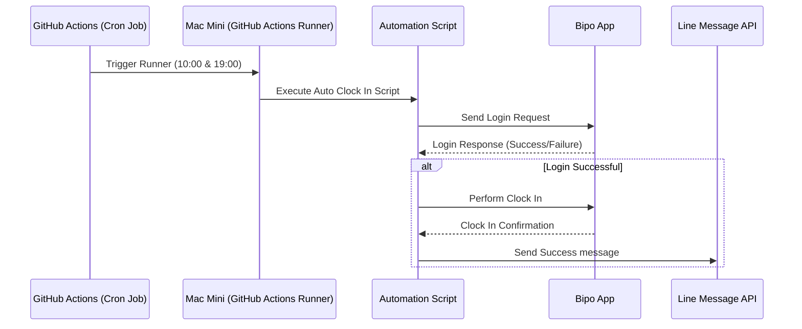

# auto-check-in

## 專案簡介
由於每天都會忘記打卡，而希望藉由 github action 來實現 自動打卡

- 自動登入 Bipo 
- 每天 10:00, 19:00 在隨機加上 15 ~ 130 秒
- 完成後自動發送通知到 Line

## 需要設定的 ENV
- LINE_CHANNEL_ACCESS_TOKEN: 用於發送 Line 通知的存取權杖
- LINE_USER_ID: 接收 Line 通知的使用者 ID
- BIPOID: 用於登入 BIPO 的使用者 ID
- BIPOPASSWORD: 用於登入 BIPO 的密碼

## 流程圖

